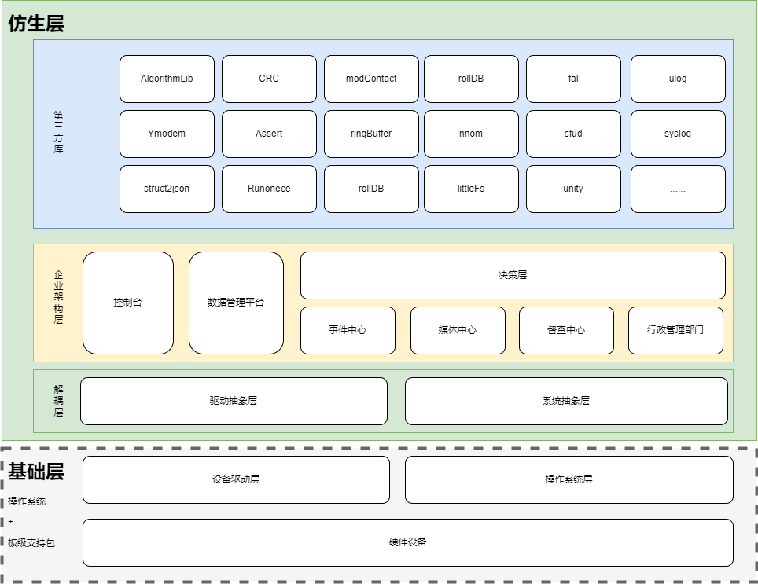

# arnics-os

```text
________________________________________________
    __      ____    _   _  ___   ____  ____  
   /  \    |  _ \  | \ | ||_ _| / ___|/ ___| 
  / /\ \   | |_) | |  \| | | | | |    \___ \ 
 / ____ \  |  _ <  | . ` | | | | |     ___) |
/_/    \_\ |_| \_\ |_|\__||___| \____||____/ 
________________________________________________
```

**Artificial Socialnics Program Operation System(社会仿生业务系统架构)**

[English Documentation](README.en.md) | 中文文档

## 1. 简介 (Introduction)

`arnics-os` 是一个创新的**社会仿生模型 (Socialnics Model)** 嵌入式/跨平台系统架构。它摒弃了传统的强耦合任务划分方式，将系统抽象为一个“企业社会”。在这个社会中，不同的功能模块被划分为不同的“部门 (Department)”，各部门之间通过标准化的“公文 (消息机制)”和“职能 (API)”进行协作。

这种架构带来了极高的**模块化、可插拔性和易维护性**，无论是裸机 (Bare-metal)、RTOS (如 FreeRTOS)，还是高级系统 (Linux/Windows)，都能提供一致的开发体验。



## 2. 核心架构设计 (Architecture Design)

`arnics-os` 的架构自下而上分为以下几层：

### 2.1 驱动框架 (Driver Framework)
- **类 Unix 设备模型**：提供统一的 `open`, `close`, `read`, `write`, `ctl` 接口。
- **硬件解耦**：BSP 层与驱动抽象层分离，使应用层代码完全与硬件无关。
- [了解更多驱动框架细节](arnics-os/drivers/drivers.md)

### 2.2 核心内核 (arnicsCore)
- **表驱动执行内核**：系统不再充斥着海量的 `if/else` 或 `switch/case`，所有能力（初始化、命令分发、模块功能）都被注册为一张函数表。
- **分发器 (Dispatcher)**：基于 `Department (部门)`、`Name (名称)`、`Level (层级)` 精确执行系统能力。
- [了解内核设计](arnics-os/core/arnicsCore.md)

### 2.3 操作系统抽象层 (OSAL / rtosInterface)
- **统一接口**：抹平不同操作系统之间的差异（线程创建、延迟、队列、互斥锁）。
- **多平台支持**：已内置 FreeRTOS、Linux、Windows 接口。

### 2.4 数据管理平台 (Data Platform)
- **公私有分离**：统一的参数、配置、状态管理，模块间数据隔离。
- **持久化存储**：自带 CRC 校验的 Flash 持久化机制，确保掉电数据安全。
- [了解数据平台细节](arnics-os/dataPlat/dataPlat.md)

### 2.5 部门抽象 (Departments)
系统功能被具象化为七大核心部门：
- **事件中心 (Center Event)**：作为调度枢纽，采用”员工模型（雇佣工、内部员工、外部员工）”分配和处理系统事件。[查看详情](arnics-os/dePartment/centerEvent/centerEvent.md)
- **决策层 (Center Business)**：处理核心决策与业务逻辑，专注于产品特定功能的实现。[查看详情](arnics-os/dePartment/centerBusiness/centerBusiness.md)
- **媒体中心 (Center Media)**：负责所有对外的人机交互（HMI）、UI 显示、音频提示与多媒体策略。[查看详情](arnics-os/dePartment/centerMedia/centerMedia.md)
- **督察中心 (Center Guard)**：负责系统看门狗、异常监控、错误恢复与日志审计。[查看详情](arnics-os/dePartment/centerGuard/centerGuard.md)
- **行政管理 (Center Administrative)**：负责系统休眠/唤醒管理、消息路由分发与跨部门协调。
- **控制台 (Center Console)**：提供 CLI 命令行接口，支持运行时调试与系统控制。
- **消息总线 (Center Bus)**：统一消息总线，编译期路由表 + O(1) 分发，替代硬编码的跨部门队列直接访问。

## 3. 目录结构 (Directory Structure)

```text
arnics-os/
  ├── Inc/             # 全局头文件 (projDefine.h, typedef.h, include.h)
  ├── core/            # 极轻量表驱动内核 (arnicsCore)
  ├── common/          # 通用组件 (TaskTimer 软件定时器等)
  ├── dataPlat/        # 数据管理平台 (参数、状态、持久化)
  ├── dePartment/      # 业务部门 (仿生架构核心)
  │   ├── centerEvent/         # 事件中心
  │   ├── centerBusiness/      # 决策层
  │   ├── centerMedia/         # 媒体中心
  │   ├── centerGuard/         # 督察中心
  │   ├── centerAdministrative/# 行政管理
  │   ├── centerConsole/       # 控制台
  │   └── centerBus/           # 消息总线
  ├── drivers/         # 跨平台驱动框架 (类Unix风格)
  ├── port/            # 内存与基础接口移植层
  ├── routine/         # 系统任务管理与初始化清单
  ├── rtosInterface/   # OS 抽象层 (FreeRTOS/Linux/Win)
  ├── thirdParty/      # 第三方组件 (uflog, cJSON, unity等)
  └── document/        # 设计文档与架构图
```

## 4. 快速开始 (Quick Start)
本项目：
- 可在windows环境下，直接使用Visual Studio打开，编译运行。
- 可在linux下，运行build-arnics-os.sh，生成可执行文件后运行。
- 作为底层系统，嵌入单片机工程环境运行。

### 4.1 环境准备
- 支持平台：STM32 (全系列)、Windows、Linux
- 编译器：GCC、Keil MDK、IAR
- 依赖：请确保您使用的平台已提供对应的 BSP 支持。`document/templete` 下提供了 STM32 各系列的工程模板。

### 4.2 系统启动流程
系统启动极其简单，得益于表驱动内核，您只需调用：

```c
#include "Inc/include.h"

int main()
{
  // 1. 启动 OS
  arnics_task_init();
  while (1)
    {
        rtosThreadDelay(1000);
    }
  return 0;
}
```

## 5. 参与贡献 (Contributing)

欢迎提交 Issue 和 Pull Request，让我们一起完善这个“企业社会”！

## 6. 开源协议 (License)

本项目遵循 Apache 2.0 开源协议。详情请参阅 [LICENSE](LICENSE) 文件。
  