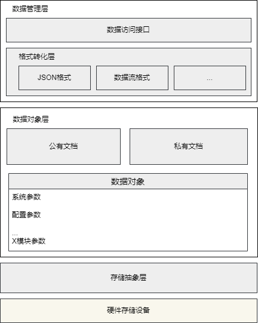

# 数据管理平台
[English](dataPlat.en.md) | 中文

## 1. 概述

DataPlat 是一个轻量级的嵌入式系统数据管理平台，旨在提供统一的数据管理、存储和访问机制。通过公有/私有文档的分离设计，DataPlat 实现了模块间数据共享与隔离，并支持持久化存储，确保关键数据在掉电后能够恢复。

### 核心功能
- **数据统一管理**：支持多种数据类型的定义、存储和访问。
- **模块化设计**：通过公有/私有文档分离实现模块间数据隔离。
- **持久化存储**：支持带 CRC 校验的 Flash 存储，确保数据完整性。
- **灵活扩展**：通过宏定义简化数据操作，便于快速扩展新功能。

---

## 2. 系统架构

DataPlat 采用分层架构设计，主要包括以下三个核心层次：



### 2.1 数据管理层 (dataManager)
提供统一的数据操作接口，包括：
- 数据存储与加载
- 数据校验与打包
- 数据访问控制
### 2.2 数据对象层 (dataObj)

定义具体的数据对象，例如：
- **arnicsPara**：系统参数
- **systemCfg**：系统配置
- **systemStatus**：系统状态

### 2.3 存储抽象层
通过 FAL (Flash 抽象层) 提供对物理存储设备的统一访问。

---

## 3. 文件组织结构

```
dataPlat/
  ├── dataObj/                 # 数据对象定义
  │   ├── arnicsPara/          # 系统参数对象
  │   │   ├── arnicsPara.h     # 私有头文件
  │   │   ├── arnicsPara.c     # 实现文件
  │   │   └── arnicsParaPublic.h # 公共头文件
  │   ├── systemCfg/           # 系统配置对象
  │   │   ├── systemConfig.h   # 私有头文件
  │   │   ├── systemConfig.c   # 实现文件
  │   │   └── systemConfigPublic.h # 公共头文件
  │   ├── systemStatus/        # 系统状态对象
  │   │   ├── systemStatus.h   # 私有头文件
  │   │   ├── systemStatus.c   # 实现文件
  │   │   └── systemStatusPublic.h # 公共头文件
  │   └── dataClass.h          # 数据对象的统一定义
  ├── dataManager/             # 数据管理层
  │   ├── dataManagerList.h    # 数据管理列表
  │   ├── dataStore.h          # 数据存储接口
  │   └── dataStore.c          # 数据存储实现
  ├── dataCore/                # 数据核心层
  │   ├── dataCore.h           # 核心接口定义
  │   └── dataStruct.h         # 数据结构定义
  ├── dataApi/                 # 数据访问接口
  │   ├── dataApi.h            # 数据访问接口定义
  │   └── dataPublic.h         # 公共数据访问接口
  └── thirdParty/              # 第三方库
      ├── AlgorithmLib/        # 算法库
      │   └── crc16.h          # CRC16 校验算法
      └── fal/                 # Flash 抽象层
          ├── fal.h            # FAL 接口定义
```

---

## 4. 公有/私有文档定义

### 4.1 定义机制
- **公有文档**：定义模块间共享的数据和接口，位于 `*Public.h` 文件中。
- **私有文档**：定义模块内部使用的数据和函数，位于 `.h` 和 `.c` 文件中。

### 4.2 示例
#### 公有文档
```c
// filepath: dataPlat/dataObj/arnicsPara/arnicsParaPublic.h
extern bool arnics_para_save(void);
extern bool arnics_para_load(void);
```

#### 私有文档
```c
// filepath: dataPlat/dataObj/arnicsPara/arnicsPara.h
extern uint8_t           virtual_environment;  
extern bool              eventos_want_sleep;
```

---

## 5. 持久化存储支持

DataPlat 提供对 Flash 等非易失性存储器的支持，确保数据的持久化存储和完整性。

### 5.1 存储机制
- **CRC 校验**：采用 CRC16 校验机制，确保数据完整性。
- **分区管理**：通过 FAL 管理 Flash 分区，不同类型的数据存储在独立分区中。
- **数据打包/解包**：通过统一的打包和解包机制管理存储格式。

### 5.2 核心接口
```c
bool data_save(const char *part_name, size_t offset, uint8_t *buf, size_t len);
bool data_load(const char *part_name, size_t offset, uint8_t *buf, size_t len);
bool value_pack_with_crc16(const store_operation_t* op, uint8_t* src_buf, size_t src_len);
bool value_load_with_crc16(const store_operation_t* op, uint8_t* dest_buf, size_t dest_len);
```

---

## 6. 数据操作宏

DataPlat 提供了一系列宏定义，简化数据对象的定义和操作：

```c
// 定义带 CRC 校验的数据结构
#define STRUCT_WITH_CRC(type, var) 
// 定义存储支持
#define SOTRE_SUPPORT(var) 
// 定义数据操作函数
#define DEFINE_DATA_ACTION_FUNC(type_t, param) 
```

---

## 7. 示例代码 (以 arnicsPara 为例)

以下是使用 DataPlat 管理 `arnicsPara` 参数的完整示例。

### 7.1 定义参数

在 `arnicsPara` 文件夹中展示了定义公有/私有文档、存储支持和数据操作函数的示例。

```
filepath: dataPlat\dataObj\arnicsPara
```


---

通过以上示例，展示了如何使用 DataPlat 平台定义、加载、保存和使用参数。开发者可以根据此模板快速实现其他参数的管理。
