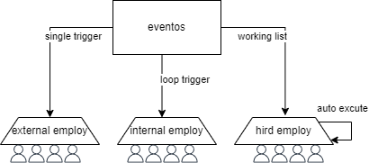

# Event Center User Manual
English | [中文文档](centerEvent.en.md)
## 1. Overview

Event Center is one of the core components in the arnics-os system. This department accepts event execution requests, is responsible for processing and managing various events, and replies with execution results. It adopts an employee model to handle different types of events, including hired employees, internal employees, and external employees. The following is the Event Center model




## 2. Employee Model Concept

### 2.1 Hired Employee (EVENT_HIRED_EMPLOY)

Hired employee is a special event handling method with the following characteristics:

- **Execution Method**: Creates independent RTOS tasks for each event
- **Priority**: Different priorities and stack sizes can be specified for each hired employee task
- **Independence**: Each hired employee executes in its own task context without interfering with each other
- **Resource Management**: Resources are automatically released after task execution is completed
- **Application Scenarios**: Suitable for handling time-consuming events or events that require an independent running environment

### 2.2 Internal Employee (EVENT_INTERNAL_EMPLOY)

Internal employee is the conventional event handling method of the Event Center with the following characteristics:

- **Execution Method**: Automatically executed in a loop by the Event Center kernel according to the registry order
- **Trigger Condition**: Executes a parameterized response once after receiving the corresponding external request
- **Execution Environment**: Executes in the main task context of the Event Center
- **Application Scenarios**: Suitable for handling fast, simple events that do not require an independent task environment

### 2.3 External Employee (EVENT_EXTERNAL_EMPLOY)

External employee is a message-driven event handling method with the following characteristics:

- **Execution Method**: Message-driven invocation
- **Trigger Condition**: Parameterized response after receiving the corresponding external request
- **Execution Environment**: Executes in the main task context of the Event Center
- **Execution Order**: Executes after hired employees and before internal employees
- **Application Scenarios**: Suitable for event handling that needs to respond to external messages

## 3. Event Center Workflow

The Event Center workflow mainly includes the following states:

1. **OnWattingOutMsg**: Waiting for external message state
   - The Event Center waits for receiving external messages in this state
   - If there are no messages, internal employee functions will be executed
   - Switches to ActionMsg state after receiving a message

2. **ActionMsg**: Command execution state
   - Processes received messages
   - Executes corresponding event handling functions in the order of hired employees, external employees, and internal employees
   - Switches to SendingRspMsg state after processing is completed

3. **SendingRspMsg**: Return external message execution result state
   - Checks whether a message reply is needed
   - Sends a response message if a reply is needed
   - Switches back to OnWattingOutMsg state after completion

## 4. Event Trigger Mechanism and Response Mechanism

### 4.1 Employee Type Trigger Mechanism Comparison

| Employee Type | Trigger Method | Execution Environment | Priority | Blocking Allowed | Kernel Delay Support |
|---------|---------|---------|-------|----------|---------|
| Hired Employee | Create independent RTOS task | Independent task context | Configurable | Does not affect other events | Not supported |
| Internal Employee | Kernel automatic loop execution | Event Center main task | Medium | Blocks main loop | Supported |
| External Employee | Message-driven invocation | Event Center main task | High | Blocks main loop | Not supported |

### 4.2 Parameter Passing Mechanism

| Employee Type | Parameter Passing Method | Behavior Without Parameters | Parameter Definition | Lifecycle |
|---------|------------|----------|---------|---------|
| Hired Employee | argv pointer | Normal execution, parameter is NULL | <Event Center employee function name>_msg | Released after task completion |
| Internal Employee | argv pointer | Normal execution, parameter is NULL | <Event Center employee function name>_msg | Released after execution completion |
| External Employee | argv pointer | Normal execution, parameter is NULL | <Event Center employee function name>_msg| Released after execution completion |

### 4.3 Message Response Mechanism

| Employee Type | Message Response Mechanism | Trigger Condition | Acquisition Method | Timeout Handling | Data Structure | Execution Flow |
|---------|--------|---------|---------|---------|---------|---------|
| Hired Employee | Supported | needRsp=true | Message recycling API interface | Returns false | Custom | Main loop creates task→Waits for task completion→Collects results→Returns message result |
| Internal Employee | Supported | needRsp=true | Message recycling API interface | Returns false | Custom | Main loop executes→Waits for completion→Collects results→Returns message result |
| External Employee | Supported | needRsp=true | Message recycling API interface | Returns false | Custom | Message-driven execution→Waits for completion→Collects results→Returns message result |

**Important Note**: For all employee types, when needRsp=true, the Event Center will wait for the function to complete, collect results, and return the Rsp parameter to the message queue. This mechanism remains consistent across all employee types, ensuring that the caller can obtain event processing results.

### 4.4 Employee Function Message Naming Requirements

The Event Center has strict requirements for employee function message structure naming, which must follow the following specifications:

| Message Type | Structure Naming | Variable Naming | Example |
|---------|----------|---------|------|
| Request Message | `{function_name}_msg_t` | `{function_name}_msg` | `event_handler_msg_t event_handler_msg` |

**Naming Rules**:
- Structure must end with `_msg_t`
- Variable must end with `_msg`
- Function name prefix must be consistent with structure name prefix


**Detailed Naming Rules**:
1. Request message structure must be named `{function_name}_msg_t`. For example, if the employee function name is `example_handler_msg`, its request message structure must be named `example_handler_msg_t`
2. All naming must use lowercase letters with words connected by underscores
3. This naming convention is the basis of the Event Center message routing mechanism. Not following this naming convention will cause messages to fail to route correctly

**Sample Code**:
Request message structure:
```
typedef struct 
{
    /*req*/
    uint32_t example_handler_req;
    /*rsp*/
    uint8_t example_handler_rsp;
} example_handler_msg_t;
```
Employee function message definition:
```
/*--------------------*/
/* led1_actionk员工函数 */
example_handler_msg_t example_handler_msg;
/*--------------------*/
```
Employee function definition
```
// 员工函数定义
void example_handler(void *argv)
{
   if(NULL != argv)
   {
      example_handler_msg_t* message = (example_handler_msg_t*)argv;
       /* some action*/
   }
   else
   {
      /* some action*/
   }
}

```


### 4.5 API Interfaces

The Event Center provides the following API interfaces:

#### 4.4.1 Event Handling Related

```
// Event handling main function
void event_process();
```

#### 4.4.2 Event Flag Management

```
// Add event flag to existing event set
bool add_event_flag(eventFlag_t *eventflag, const char *name, bool ismsg);

// Set event flag, clear all previous events
bool set_event_flag(eventFlag_t *eventflag, const char *name, bool ismsg);
```

#### 4.4.3 Message Communication

```
// Send message to Event Center
uint32_t SendEventCallToEventCenter(eventFlag_t eventflag, time_t wait);

// Get response message from Event Center
bool GetResponseMessageFromEventCenter(time_t ID, time_t wait, void *argv);
```

## 5. Usage Examples

### 5.1 Register Event Handling Function

In eventList.h file, use X macro to register event handling employee function:

```
// Employee function registration
#define REGISTER_ENTRIES     
   X(event_handler_1, EVENT_EXTERNAL_EMPLOY, false)     
   X(event_handler_2, EVENT_INTERNAL_EMPLOY, true)     
   X(event_handler_3, EVENT_HIRED_EMPLOY, true)
```

### 5.2 Hired Employee Configuration

If using hired employee, you can configure the task parameters of hired employee in eventList.h:

```
#define HIRD_EMPLOY_STATIC_REFERENCE     
   Y(event_handler_3, rtosPriorityHigh, 1024)     
   Y(event_handler_4, rtosPriorityNormal, 512)
```

### 5.3 Send Event to Event Center

```
// Create event flag
eventFlag_t eventFlag;
memset(&eventFlag, 0, sizeof(eventFlag_t));

// Add event
add_event_flag(&eventFlag, "event_handler_1", true);
add_event_flag(&eventFlag, "event_handler_2", false);

// Set message parameters
eventFlag.msg.event_handler_1_msg.param1 = 100;
eventFlag.msg.event_handler_1_msg.param2 = "test";

// Send event to Event Center
uint32_t eventId = SendEventCallToEventCenter(eventFlag, 100);
```

### 5.4 Get Event Handling Result

```
// Define structure to receive message
event_handler_2_msg_t responseMsg;

// Get response message
bool result = GetResponseMessageFromEventCenter(eventId, 1000, &responseMsg);
if (result) 
{
    // Get response successfully
    printf("Received response: %d\n", responseMsg.result);
} 
else 
{
    // Get response failed
    printf("Failed to get response\n");
}
```

### 5.5 Internal Employee Using Delay

```
// Internal employee event handling function example
void event_handler_2(void *argv) 
{
    EVET_START
    event_handler_2_msg_t *msg = (event_handler_2_msg_t *)argv;

    // Use delay (only for internal employees)
    EVET_DELAY(100); // Delay 100ms

    // Continue executing operations
    msg->result = 0;

    EVET_END;
}
```

## 6. Notes

1. **Hired Employee Notes**:
   - Hired employee tasks will occupy independent RTOS resources. Please configure task priority and stack size reasonably
   - Hired employee tasks will be automatically deleted after execution is completed. No need to manually manage task lifecycle
   - If a hired employee is running, triggering the same event again will be rejected

2. **Internal Employee Notes**:
   - Internal employees execute in the main task context of the Event Center. Please avoid long blocking
   - Internal employees can use EVET_DELAY for delay
   - Internal employee functions should be as short and efficient as possible

3. **External Employee Notes**:
   - External employees execute in the main task context of the Event Center. Please avoid long blocking
   - External employee functions should be as short and efficient as possible
   - External employees cannot use EVET_DELAY for delay

4. **Message Communication Notes**:
   - When sending messages, please ensure the correctness of message parameters
   - When getting response messages, please ensure the wait time is long enough or blocking wait, so that event processing is completed

## 7. Summary

The Event Center provides a flexible event handling mechanism through the employee model, suitable for different scenarios. By using hired employees, internal employees, and external employees reasonably, an efficient and reliable event handling system can be constructed.
