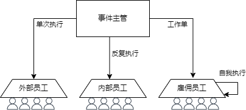

# 事件中心使用手册

## 1. 概述

事件中心是arnics-os系统中的核心组件之一，该部门接受事件的执行申请，负责处理和管理各种事件，并回复执行结果。它采用了员工模型来处理不同类型的事件，包括雇佣工、内部员工和外部员工。以下为事件中心模型



## 2. 员工模型概念

### 2.1 雇佣工 (EVENT_HIRED_EMPLOY)

雇佣工是一种特殊的事件处理方式，具有以下特性：

- **执行方式**：为每个事件创建独立的RTOS任务
- **优先级**：可以为每个雇佣工任务指定不同的优先级和堆栈大小
- **独立性**：每个雇佣工在自己的任务上下文中执行，互不干扰
- **资源管理**：任务执行完成后自动释放资源
- **适用场景**：适合处理耗时较长或需要独立运行环境的事件

### 2.2 内部员工 (EVENT_INTERNAL_EMPLOY)

内部员工是事件中心的常规事件处理方式，具有以下特性：

- **执行方式**：由事件中心内核按照注册表顺序自动循环执行
- **触发条件**：收到相应外部需求后执行一次带参响应
- **执行环境**：在事件中心的主任务上下文中执行
- **适用场景**：适合处理快速、简单的事件，不需要独立的任务环境

### 2.3 外部员工 (EVENT_EXTERNAL_EMPLOY)

外部员工是消息驱动型的事件处理方式，具有以下特性：

- **执行方式**：消息驱动型调用
- **触发条件**：收到相应外部需求后带参响应
- **执行环境**：在事件中心的主任务上下文中执行
- **执行顺序**：在雇佣工之后，内部员工之前执行
- **适用场景**：适合需要响应外部消息的事件处理

## 3. 事件中心工作流程

事件中心的工作流程主要包括以下几个状态：

1. **OnWattingOutMsg**：等待外部消息状态
   - 事件中心在此状态下等待接收外部消息
   - 如果没有消息，会执行内部员工函数
   - 收到消息后切换到ActionMsg状态

2. **ActionMsg**：执行命令状态
   - 处理接收到的消息
   - 按照雇佣工、外部员工、内部员工的顺序执行相应的事件处理函数
   - 处理完成后切换到SendingRspMsg状态

3. **SendingRspMsg**：返回外部消息的执行结果状态
   - 检查是否需要回复消息
   - 如果需要回复，发送响应消息
   - 完成后切换回OnWattingOutMsg状态

## 4. 事件触发机制与响应机制

### 4.1 员工类型触发机制对比

| 员工类型 | 触发方式 | 执行环境 | 优先级 | 是否可阻塞 | 内核延时支持 |
|---------|---------|---------|-------|----------|---------|
| 雇佣工 | 创建独立RTOS任务 | 独立任务上下文 | 可配置 | 不影响其他事件 | 不支持 |
| 内部员工 | 内核自动循环执行 | 事件中心主任务 | 中等 | 阻塞主循环 | 支持 |
| 外部员工 | 消息驱动型调用 | 事件中心主任务 | 高 | 阻塞主循环 | 不支持 |

### 4.2 参数传递机制

| 员工类型 | 参数传递方式 | 不传参表现 | 参数定义 | 生命周期 |
|---------|------------|----------|---------|---------|
| 雇佣工 | argv指针 | 正常执行，参数为NULL | <事件中心员工函数名>_msg | 任务完成后释放 |
| 内部员工 | argv指针 | 正常执行，参数为NULL | <事件中心员工函数名>_msg | 执行完成后释放 |
| 外部员工 | argv指针 | 正常执行，参数为NULL | <事件中心员工函数名>_msg| 执行完成后释放 |

### 4.3 消息响应机制

| 员工类型 | 消息响应机制 | 触发条件 | 获取方式 | 超时处理 | 数据结构 | 执行流程 |
|---------|--------|---------|---------|---------|---------|---------|
| 雇佣工 | 支持 | needRsp=true | 消息回收api接口 | 返回false | 自定义 | 主循环创建任务→等待任务完成→收集结果→返回消息结果 |
| 内部员工 | 支持 | needRsp=true | 消息回收api接口 | 返回false | 自定义 | 主循环执行→等待完成→收集结果→返回消息结果 |
| 外部员工 | 支持 | needRsp=true | 消息回收api接口 | 返回false | 自定义 | 消息驱动型执行→等待完成→收集结果→返回消息结果 |

**重要说明**：所有员工类型在needRsp=true时，事件中心都会等待函数执行完毕，收集结果并将Rsp参数返回到消息队列。这一机制在所有员工类型中保持一致，确保调用方能获取事件处理结果。

### 4.4 员工函数消息命名要求

事件中心对员工函数的消息结构体命名有严格要求，必须遵循以下规范：

| 消息类型 | 结构体命名 | 变量命名 | 示例 |
|---------|----------|---------|------|
| 请求消息 | `{函数名}_msg_t` | `{函数名}_msg` | `event_handler_msg_t event_handler_msg` |

**命名规则**：
- 结构体必须以 `_msg_t` 结尾
- 变量必须以 `_msg` 结尾
- 函数名前缀必须与结构体名前缀一致


**命名规则详解**：
1. 请求消息结构体必须命名为 `{函数名}_msg_t`，例如员工函数名为 `example_handler_msg`，则其请求消息结构体必须命名为 `example_handler_msg_t`
2. 命名必须全部使用小写字母，单词间用下划线连接
3. 此命名约定是事件中心消息路由机制的基础，不遵循此命名规范将导致消息无法正确路由

**示例代码**：
请求消息结构体:
```c
typedef struct 
{
    /*req*/
    uint32_t example_handler_req;
    /*rsp*/
    uint8_t example_handler_rsp;
} example_handler_msg_t;
```
员工函数消息定义：
```c
/*--------------------*/
/* led1_actionk员工函数 */
example_handler_msg_t example_handler_msg;
/*--------------------*/
```
员工函数定义
```c
// 员工函数定义
void example_handler(void *argv)
{
   if(NULL != argv)
   {
      example_handler_msg_t* message = (example_handler_msg_t*)argv;
       /* some action*/
   }
   else
   {
      /* some action*/
   }
}

```


### 4.5 API接口

事件中心提供了以下API接口：

#### 4.4.1 事件处理相关

```c
// 事件处理主函数
void event_process();
```

#### 4.4.2 事件标志管理

```c
// 添加事件标志到现有事件集合
bool add_event_flag(eventFlag_t *eventflag, const char *name, bool ismsg);

// 设置事件标志，清除之前所有事件
bool set_event_flag(eventFlag_t *eventflag, const char *name, bool ismsg);
```

#### 4.4.3 消息通信

```c
// 向事件中心发送消息
uint32_t SendEventCallToEventCenter(eventFlag_t eventflag, time_t wait);

// 从事件中心获取响应消息
bool GetResponseMessageFromEventCenter(time_t ID, time_t wait, void *argv);
```

## 5. 使用示例

### 5.1 注册事件处理函数

在eventList.h文件中，使用X宏注册事件处理员工函数：

```c
// 员工函数注册
#define REGISTER_ENTRIES     
   X(event_handler_1, EVENT_EXTERNAL_EMPLOY, false)     
   X(event_handler_2, EVENT_INTERNAL_EMPLOY, true)     
   X(event_handler_3, EVENT_HIRED_EMPLOY, true)
```

### 5.2 雇佣工配置

如果使用雇佣工，可以在eventList.h中配置雇佣工的任务参数：

```c
#define HIRD_EMPLOY_STATIC_REFERENCE     
   Y(event_handler_3, rtosPriorityHigh, 1024)     
   Y(event_handler_4, rtosPriorityNormal, 512)
```

### 5.3 发送事件到事件中心

```c
// 创建事件标志
eventFlag_t eventFlag;
memset(&eventFlag, 0, sizeof(eventFlag_t));

// 添加事件
add_event_flag(&eventFlag, "event_handler_1", true);
add_event_flag(&eventFlag, "event_handler_2", false);

// 设置消息参数
eventFlag.msg.event_handler_1_msg.param1 = 100;
eventFlag.msg.event_handler_1_msg.param2 = "test";

// 发送事件到事件中心
uint32_t eventId = SendEventCallToEventCenter(eventFlag, 100);
```

### 5.4 获取事件处理结果

```c
// 定义接收消息的结构体
event_handler_2_msg_t responseMsg;

// 获取响应消息
bool result = GetResponseMessageFromEventCenter(eventId, 1000, &responseMsg);
if (result) 
{
    // 获取响应成功
    printf("Received response: %d\n", responseMsg.result);
} 
else 
{
    // 获取响应失败
    printf("Failed to get response\n");
}
```

### 5.5 内部员工中使用延时

```c
// 内部员工事件处理函数示例
void event_handler_2(void *argv) 
{
    EVET_START
    event_handler_2_msg_t *msg = (event_handler_2_msg_t *)argv;

    // 使用延时（仅限内部员工）
    EVET_DELAY(100); // 延时100ms

    // 继续执行操作
    msg->result = 0;

    EVET_END;
}
```

## 6. 注意事项

1. **雇佣工注意事项**：
   - 雇佣工任务会占用独立的RTOS资源，请合理配置任务优先级和堆栈大小
   - 雇佣工任务执行完成后会自动删除，不需要手动管理任务生命周期
   - 如果雇佣工正在运行，再次触发同一事件会被拒绝

2. **内部员工注意事项**：
   - 内部员工在事件中心的主任务上下文中执行，请避免长时间阻塞
   - 内部员工可以使用EVET_DELAY进行延时
   - 内部员工函数应该尽量简短高效

3. **外部员工注意事项**：
   - 外部员工在事件中心的主任务上下文中执行，请避免长时间阻塞
   - 外部员工函数应该尽量简短高效
   - 外部员工不能使用EVET_DELAY进行延时

4. **消息通信注意事项**：
   - 发送消息时，请确保消息参数的正确性
   - 获取响应消息时，请确保等待时间足够长或阻塞等待，以便事件处理完成

## 7. 总结

事件中心通过员工模型提供了一种灵活的事件处理机制，不同类型的员工适用于不同的场景。通过合理使用雇佣工、内部员工和外部员工，可以构建高效、可靠的事件处理系统。
